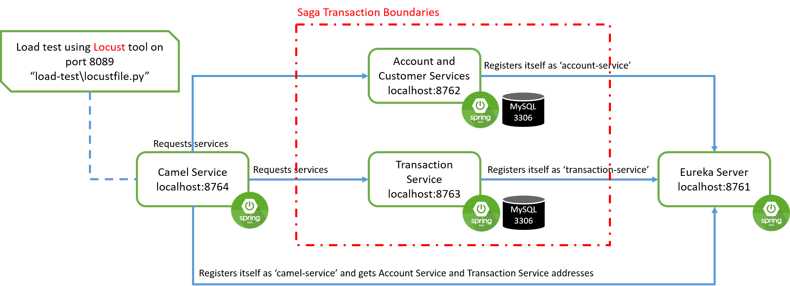
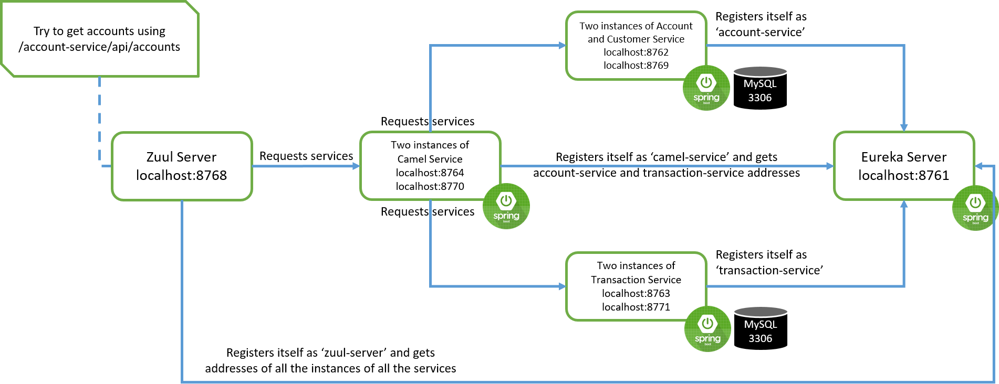

# Spring Boot + Spring Data + Apache Camel (Service Composition Using Saga EIP Example)

This is a simple example to show you how to implement a `Saga EIP` over simple 
services using `Apache Camel` and `Spring Cloud`

## Libraries and Tools
* [Module] [`Spring Boot`](https://spring.io/projects/spring-boot)
* [Module] [`Spring Cloud`](https://spring.io/projects/spring-cloud)
* [Integration Framework] [`Apache Camel`](https://camel.apache.org/)
* [ORM] `Hibernate` under abstraction of [`Spring Data JPA`](https://spring.io/projects/spring-data-jpa)
* [Database] `MySQL on port 3306`
* [Tool] [`Locust`](https://locust.io/): Tool for load test
* [Library] [`DataFactory`](https://mvnrepository.com/artifact/org.fluttercode.datafactory/datafactory/0.8): Library for generating fake data


## How it works

We provided three different demos over here. 
* Account/Transaction financial business situation demo (Im-memory Saga EIP)
* Transaction between two different banks demo (Im-memory Saga EIP)
* Load balancing demo (Zuul)

## Account/Transaction financial business situation demo (Im-memory Saga EIP)

### Architecture


This is a common and simple banking business flow. There is a simple `Customer` and `Account` service. Each customer is 
connected to some accounts. Besides for each account, there is some number of transactions over it which is provided and
handled by `Transaction` service. 
There is also a `Camel` service which tries to implement `Saga EIP` over `Account` and `Transaction` services.
All these services are registered in `Eureka` as the service registry and discovery framework.

### How to run
* Start `eureka-server` module. It can be verified using url [http://localhost:8761/](http://localhost:8761/).
* Start `account-service` module. It can be verified using url [http://localhost:8762/api/accounts/health](http://localhost:8762/api/accounts/health).
* Start `transaction-service` module. It can be verified using url [http://localhost:8763/api/transactions/health](http://localhost:8763/api/transactions/health).
* Start `camel-service` module. It can be verified using url [http://localhost:8764/health](http://localhost:8764/health).

Now your services are up and you can send transactions as `JSON` type with `Http.POST` method to 
[http://localhost:8764/make-transaction](http://localhost:8764/make-transaction) url.
Or, you can simply do the load test explained bellow.

### Load test
You should have `Python` and `Locust` installed on your system to do the load test part. To do the load test
simply run the following through the terminal in project root path:

```
cd \path\to\project\spring-boot-cloud-camel-composite-service 
\path\to\locust\locust.exe -f load-test\locustfile.py
```

This starts the locust on  [http://localhost:8089](http://localhost:8089/)
You can set number of users and catch size and then start the test
It sends a lot of `Http.POST` requests to `http://localhost:8764/make-transactions`

## Transaction between two different banks demo (Im-memory Saga EIP)

### Architecture


This is another common and simple banking business flow. There is a simple `Bank-A` and `Bank-B` service. Each bank
has a repository of transactions. We are trying to exemplify a simple transaction between banks model using `Saga EIP`. 
There is another `Camel` service which tries to implement `Saga EIP` over `Bank-A` and `Bank-B` services.
All these services are registered in `Eureka` as the service registry and discovery framework.

### How to run
* Start `eureka-server` module. It can be verified using url [http://localhost:8761/](http://localhost:8761/).
* Start `bank-a-service` module. It can be verified using url [http://localhost:8765/transactions](http://localhost:8765/transactions).
* Start `bank-b-service` module. It can be verified using url [http://localhost:8766/transactions](http://localhost:8766/transactions).
* Start `camel-transfer-service` module. It can be verified using url [http://localhost:8767/health](http://localhost:8767/health).

Now your services are up and you can send transactions as `JSON` type with `Http.POST` method to 
[http://localhost:8767/transfer](http://localhost:8767/transfer) url.
Or, you can simply do the load test explained bellow.

### Load Test
You should have `Python` and `Locust` installed on your system to do the load test part. To do the load test
simply run the following through the terminal in project root path:

```
cd \path\to\project\spring-boot-cloud-camel-composite-service 
\path\to\locust\locust.exe -f load-test\locustfile-transfer.py
```

This starts the locust on  [http://localhost:8089](http://localhost:8089/)
You can set number of users and catch size and then start the test
It sends a lot of `Http.POST` requests to `http://localhost:8767/transfer`

## Load balancing demo (Zuul)

### Architecture
Zuul, among many other things, fetches from Eureka service locations and does server-side load balancing.
In order to test it, we add another instance for `account-service` named `account-service-instance2`.
This service has the same name as the `account-service` when he wants to register itself on `Eureka`.


### How to run
* Start `eureka-server` module. It can be verified using url [http://localhost:8761/](http://localhost:8761/).
* Start `account-service` module. It can be verified using url [http://localhost:8762/api/accounts/health](http://localhost:8762/api/accounts/health).
* Start `transaction-service` module. It can be verified using url [http://localhost:8763/api/transactions/health](http://localhost:8763/api/transactions/health).
* Start `camel-service` module. It can be verified using url [http://localhost:8764/health](http://localhost:8764/health).
* [Optional] Start `account-service-instance2` module. It can be verified using url [http://localhost:8769/api/accounts/health](http://localhost:8769/api/accounts/health).
* [Optional] Start `transaction-service-instance2` module. It can be verified using url [http://localhost:8771/api/transactions/health](http://localhost:8771/api/transactions/health).
* [Optional] Start `camel-service-instance2` module. It can be verified using url [http://localhost:8769/health](http://localhost:8769/health).
* Start `zuul-server` module. It can be verified using url [http://localhost:8768/actuator/info](http://localhost:8768/actuator/info).

When Zuul receives a request, it picks up one of the physical locations available and forwards requests to the actual 
service instance. The whole process of caching the location of the service instances and forwarding the request to 
the actual location is provided out of the box with no additional configurations needed.

Internally, Zuul uses Netflix Ribbon to look up for all instances of the service from the service discovery (Eureka Server).

Now you can receive accounts information through [http://localhost:8768/account-service/api/accounts](http://localhost:8768/account-service/api/accounts).
The request received by Zuul is forwarded to different instances of `account-service` in a round robin fashion.
